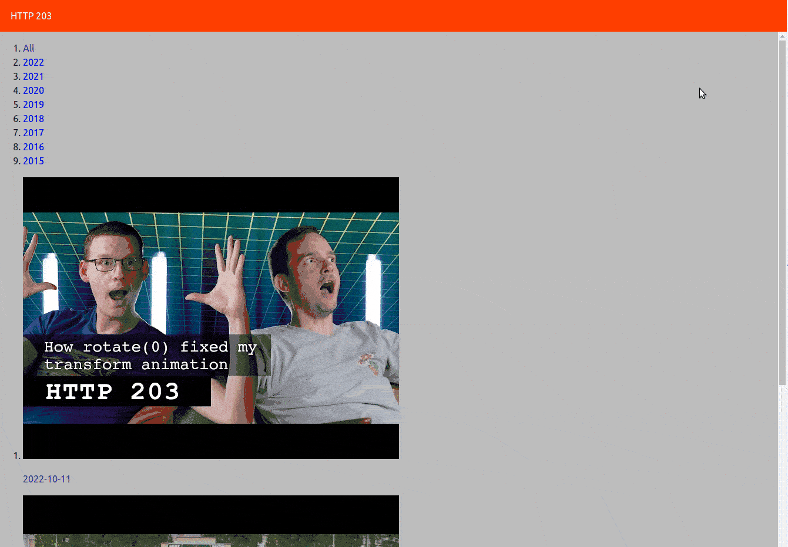
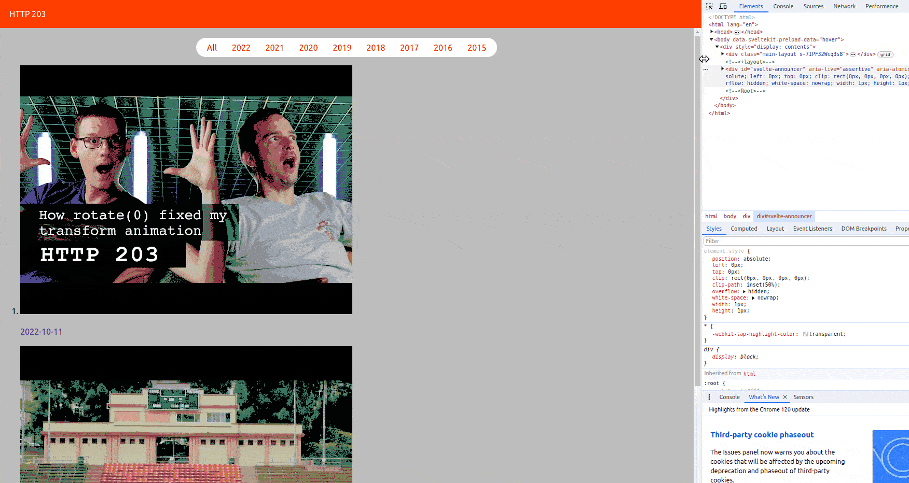
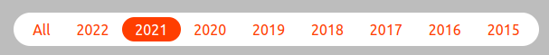
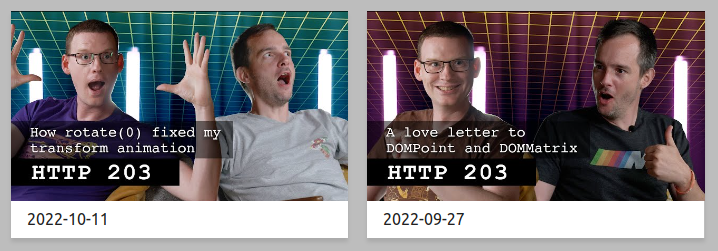
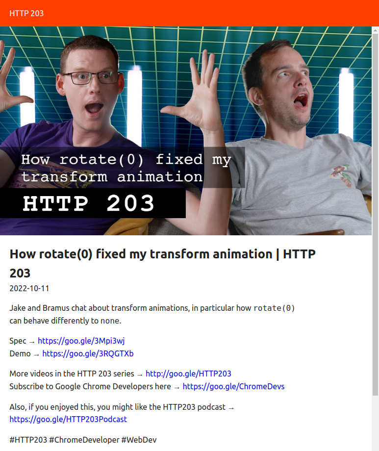
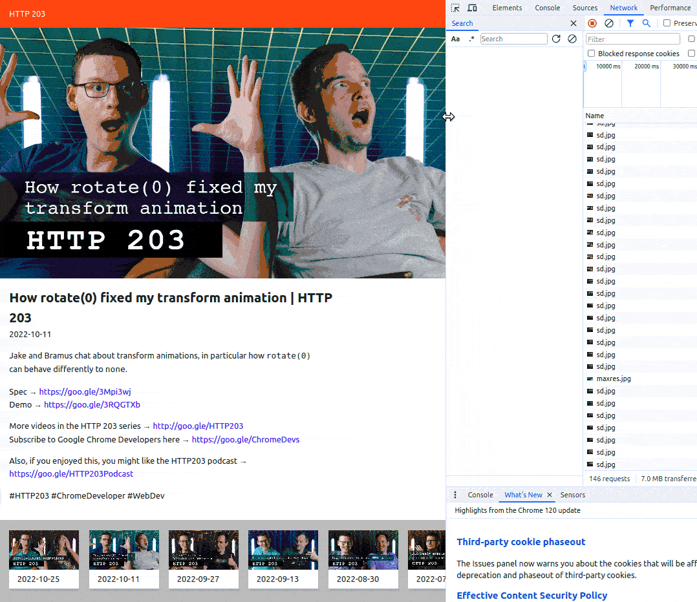
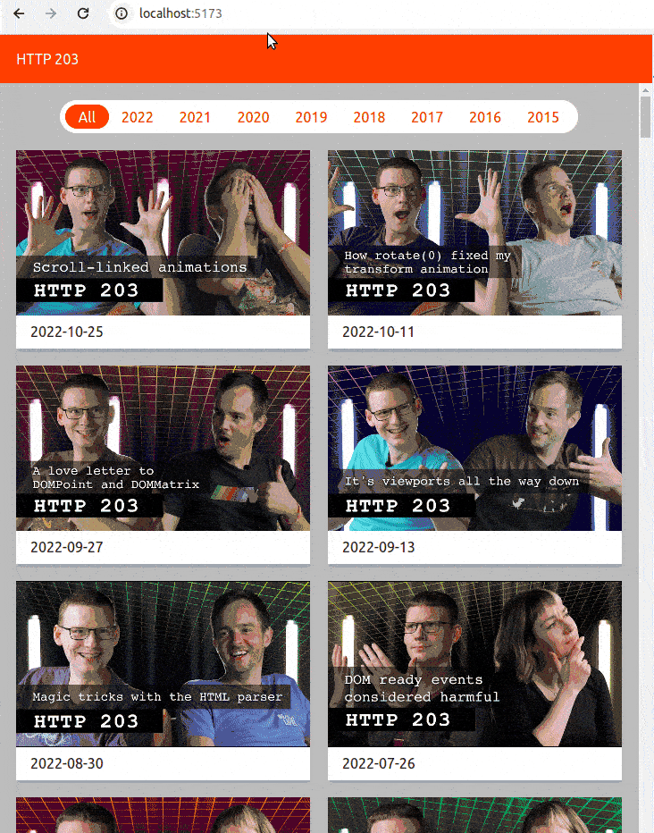
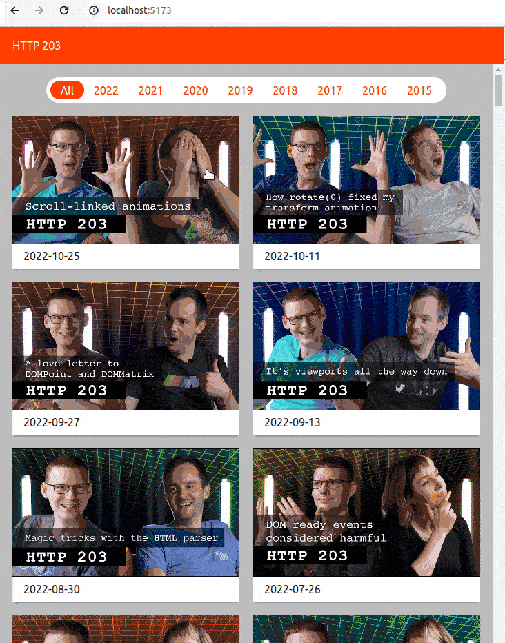
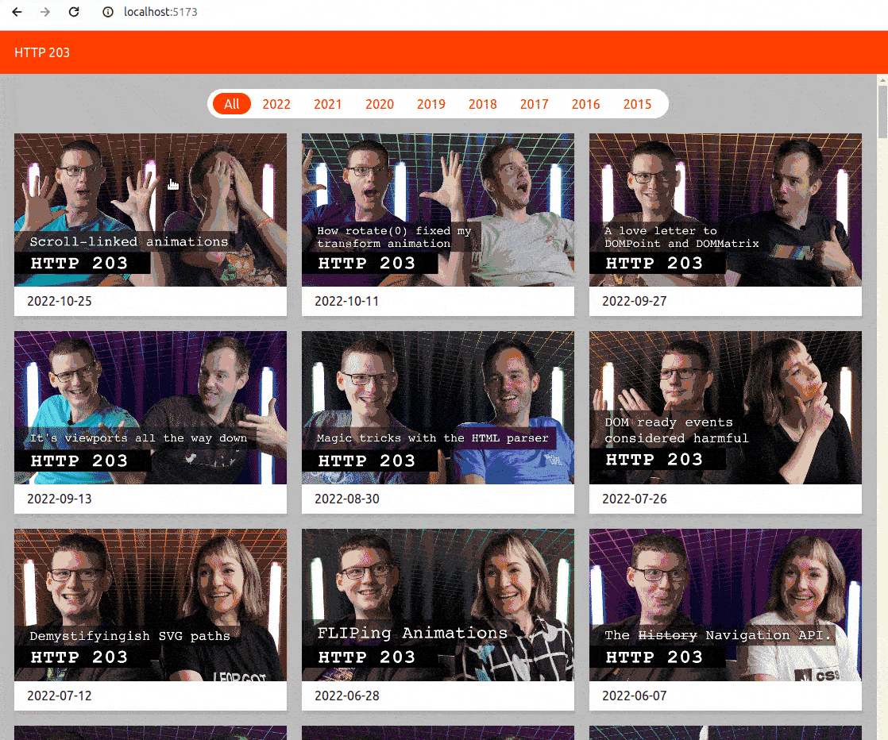
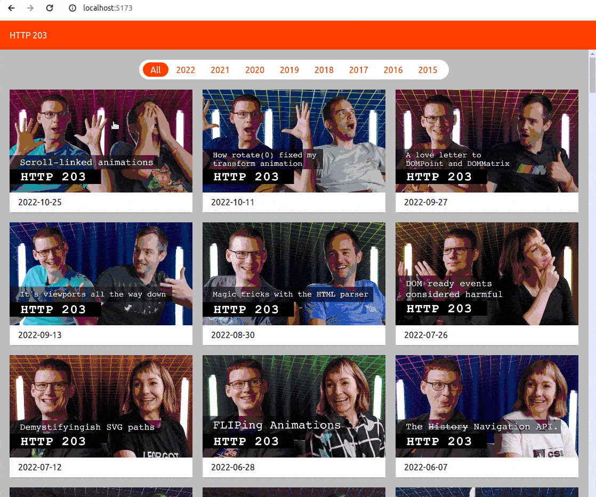

# Examen Segunda Evaluación Diseño Web y Desarrollo Cliente

# Día 14/02/2024 Tiempo: 5 horas

- Nota: Cada pregunta se valorará como bien o como mal (valoraciones intermedias serán excepcionales).
- Nota2: Cada pregunta computará únicamente en el examen al que pertenezca (diseño o desarrollo). Para resolver los apartados del examen de diseño no se debe usar JavaScript.
- Nota3: Para aprobar cada examen hay que obtener una puntuación mínima de 5 puntos en ese examen.
- Nota4: Organice su tiempo. Si no consigue resolver un apartado pase al siguiente. El examen consta de apartados de diseño y de desarrollo que se pueden resolver por separado. Si un apartado depende de otro que no sabe resolver, siempre puede dar una solución que aunque no sea correcta, le permita seguir avanzando.
- Nota5: Para que una solución sea correcta, no sólo hay que conseguir que haga lo que se pide, sino que además **todo lo que funcionaba lo tiene que seguir haciendo**. La solución debe estar implementada según las prácticas de código limpio explicadas en clase. Esto incluye JavaScript, CSS y HTML.
- Nota6: Lea completamente el examen antes de empezar y comience por lo que le parezca más fácil.
- Nota7: No se permite utilizar ninguna librería que no esté ya incluida en el fichero "package.json".

Pasos previos antes de empezar

- Clone el repositorio del enunciado

```bash
git clone https://gitlab.com/surtich/enunciado-examen-segunda-2023-2024
```

- Vaya al directorio del proyecto

```bash
cd enunciado-examen-segunda-2023-2024
```

- Si no lo hecho anteriormente, configure su usuario de git:

```bash
git config user.name "Sustituya por su nombre y apellidos"
git config user.email "Sustituya por su correo electrónico"
```

- Cree un _branch_ con su nombre y apellidos separados con guiones (no incluya mayúsculas, acentos o caracteres no alfabéticos, excepción hecha de los guiones). Ejemplo:

```bash
    git checkout -b fulanito-perez-gomez
```

- Compruebe que está en la rama correcta:

```bash
    git status
```

- Suba la rama al repositorio remoto:

```bash
    git push origin <nombre-de-la-rama-dado-anteriormente>
```

- Instale las dependencias y arranque el cliente:

```bash
    npm install
    npm run dev -- --open
```

- En otro terminal arranque el servidor:

```bash
    npm install
    npm run serve-json
```

Navegue a [http://localhost:5173/](http://localhost:5173/)

Para ver los `endpoints` navegue a [http://localhost:4000/](http://localhost:4000/)

- Dígale al profesor que ya ha terminado para que compruebe que todo es correcto y desconecte la red.

# Introducción

Jake Archibald es un desarrollador web que trabaja en Google. Es conocido por su `podcast` llamado [HTTP 203](https://www.youtube.com/playlist?list=PLNYkxOF6rcIAKIQFsNbV0JDws_G_bnNo9) en el que, en un tono desenfadado, charla con otros colegas sobre distintos temas relacionados con su profesión. En su repositorio de GitHub tiene un proyecto que enlaza todos los episodios del `podcast`. En este ejercicio se pretende imitar esta web utilizando SvelteKit.

Este es el resultado final que se espera:


Para facilitar la realización del ejercicio, se suministran los siguientes componentes y rutas (se deben usar estos componentes y no otros):

- Componente `$lib/VideoList.svelte`: para listar los vídeos.
- Componente `$lib/Switch.svelte`: para hacer el filtro de vídeos por año.
- Ruta `$routes/`: Ruta principal de la aplicación que muestra los componentes anteriores.
- Ruta `$routes/http203-[year]`: Ruta que muestra los vídeos del año seleccionado.
- Ruta `$videos/[slug]`: Ruta para mostrar los detalles de un vídeo. Desde esta ruta también se muestra la lista de vídeos.

Además dispone de los siguientes archivos:

- Fichero `app.css` ya importado por `$routes/+layout.svelte`. Tiene los estilos básicos y variables `css` con colores y distintas medidas para que las pueda usar en cualquier componente.
- Fichero `$lib/utils.js`: contiene la función `formatDate` para formatear la fecha que se muestra con cada vídeo.

La base de datos `bd.json` tiene dos `endpoints`:

- `vídeos`: Es una lista de los vídeos a mostrar. Consta de las siguientes claves:
  - `id`: Clave única de cada vídeo. Será el parámetro `slug` que usa la ruta `$videos/[slug]`.
  - `title`: Título del vídeo.
  - `published`: Fecha de publicación del vídeo.
  - `category`: Variable de tipo `string` que contiene el año de publicación del vídeo. El filtro de años del componente `$lib/Switch.svelte` muestra los valores únicos de los años de los vídeos.
- `descriptions`: Descripciones en `HTML` de los vídeos. Consta de los siguientes campos:
  - `id`: Identificador del vídeo.
  - `description`: Descripción del vídeo en formato HTML.

Además, en el `back` están almacenadas las imágenes de los vídeos en el directorio `public`. Hay un directorio para cada vídeo. El nombre del directorio se corresponde con el `id` del vídeo. En este directorio hay 4 imágenes para 2 resoluciones diferentes (`sd.jpg` y `maxres.jpg`).

# Examen de diseño

1.-(2 puntos) La cabecera tendrá el formato mostrado y se verá en todo momento quedando fija y sin sobreponerse a otros componentes.



2.-(1 punto) El selector de años tendrá el aspecto mostrado y estará siempre centrado.



3.-(0,5 puntos) El año seleccionado tendrá el estilo mostrado.



4.-(1 punto) Los vídeos de la lista de vídeos tendrán el aspecto y tamaños mostrados.



5.-(2 puntos) En la resolución de escritorio se mostrarán 5 columnas de vídeos. Las columnas se adaptarán al tamaño de la pantalla. En pantallas menores se irá ajustando el contenido hasta llegar a mostrar una única columna. Para hacer esto no se pueden usar `media queries`.


6.-(0,5 puntos) La vista de detalle del vídeo tendrá el aspecto mostrado.



7.-(3 puntos) La vista de detalle de un vídeo también muestra la lista de vídeos. Cuando la pantalla sea pequeña, la lista de vídeos se mostrará en la parte inferior en un única fila y cuando sea más grande en el panel derecho en una única columna.

Nota: Debe hacer esto utilizando el componente `$lib/VideoList.svelte` sin duplicar el código ni creando otro componente. Tampoco puede usar JavaScript para conseguir lo pedido.



# Examen de desarrollo

8.- (1 punto) La lista de vídeos se cargarán llamando al `enpoint` `http://localhost:4000/videos`.

Nota: La carga de la lista de vídeos se hará una sola vez al navegar a cualquier `URL`. No se debe volver a cargar cuando se filtre por año o se muestre la vista de detalle.

Nota: Se utilizarán las imágenes de baja resolución (`sd.jpg`) llamando al `endpoint` `http://localhost:4000/[id]/sd.jpg`. Nota: Para formatar la fecha puede llamar a la función `formatDate` que se encuentra en el archivo `$lib/utils.js`.

9-. (1,5 puntos) Los años que se muestran en el componente `$lib/Switch.svelte` se calcularán a partir del campo `published` de los vídeos. Los años se mostrarán ordenados de forma descendente y sin repetir.


10.- (1 punto) Al seleccionar un año en el componente `$lib/Switch.svelte` se mostrarán los vídeos de ese año. Si no se selecciona ningún año se mostrarán todos los vídeos (esto se consigue al pulsar sobre `All` o sobre `HTTP 203`).



11.- (0,5 puntos) Se resaltará el filtro del año aplicado (ver imagen anterior).

12.- (1 punto) Al navegar a la vista de detalle de un libro, se mostrará la imagen en máxima resolución cargándola de servidor (`http://localhost:4000/[id]/maxres.jpg`), el título del libro y la fecha formateada.

Nota: para formatear la fecha puede llamar a la función `formatDate` que se encuentra en el archivo `$lib/utils.js`.

Nota: Los datos del vídeo ya están en el cliente y, por lo tanto, no se cargarán desde el servidor.



13.- (1 punto) Para cargar y mostrar la descripción del vídeo de la vista de detalle se llamará al `endpoint` `http://localhost:4000/descriptions/[id]`.

Nota: Tenga en cuenta que la descripción tiene formato `HTML` y debe mostrarse como tal. Puede usar `@html` para mostrar el contenido `HTML` en Svelte.



14.- (2 puntos) Arregle el problema de rendimiento que hay en la vista de detalle con la repetición de llamadas al servidor para cargar la descripción. Es decir, si se navega varias veces a la vista de detalle del mismo vídeo, no se debería volver a llamar al servidor para cargar la descripción ya que esta se debería haber almacenado en el cliente.

Para aclarar lo que hay que hacer, repasemos lo realizado hasta ahora en los apartados previos:

- La lista de vídeos se carga una sola vez al navegar a cualquier `URL`.
- La descripción se carga en un `endpoint` diferente y sólo se carga la descripción del vídeo cuyo detalle se está viendo.
- Sin embargo, hay un problema de rendimiento ya que si se navega varias veces a la vista de detalle del mismo vídeo, se vuelve a cargar la descripción del vídeo. Esto no debería ocurrir.

15.- (2 puntos) Para cargar la descripción se simulará que el servidor está ocupado y que tarda 1 segundo en proporcionarla. Durante la carga, en lugar de la descripción se mostrará el mensaje "loading...". Si la descripción ya se hubiera cargado anteriormente no se hará la petición al servidor y, por lo tanto, no se simulará el retraso ni se mostrará el mensaje "loading...".

Nota: Debe obligatoriamente usar `setTimeout` para simular el retraso.



# Para entregar

- Ejecute el siguiente comando para comprobar que está en la rama correcta y ver los ficheros que ha cambiado:

```bash
    git status
```

- Prepare los cambios para que se añadan al repositorio local:

```bash
    git add .
    git commit -m "completed exam"
```

- Compruebe que no tiene más cambios que incluir:

```bash
    git status
```

- Dígale al profesor que va a entregar el examen.

- Conecte la red y ejecute el siguiente comando:

```bash
    git push origin <nombre-de-la-rama>
```

- Abandone el aula en silencio.
